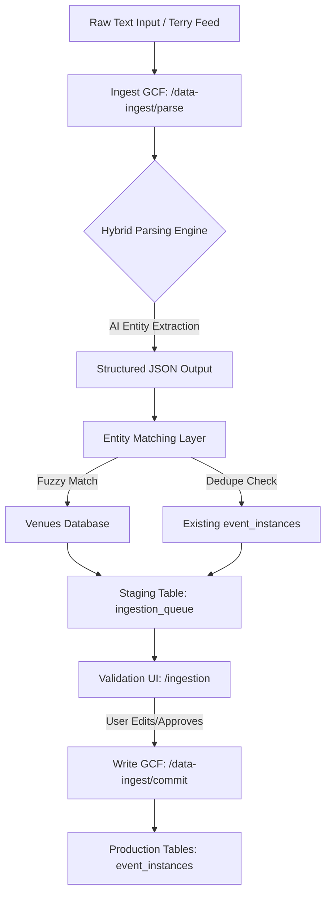

# 📋 Technical Design & Risk Audit: /data-ingest Module

This document outlines the proposed architecture for ingesting unstructured, "messy" daily event listings into the LocalPlus Partner OS ecosystem.

---

## 1. Architecture Overview
The system will operate as a standalone module (`/data-ingest`) separate from the core Event Engine to maintain data integrity.

### Data Flow Diagram


---

## 2. Recommended Parsing Approach
**Recommendation: Hybrid AI-First Extraction**

*   **Rule-based (Regex):** Used for strict time formats (HH:MM) and date pattern matching to catch obvious errors early.
*   **AI (Claude 3.5 Sonnet):** Primary engine for entity extraction from "unstructured chaos." The LLM will be prompted to return a specific JSON schema:
    ```json
    {
      "events": [
        {"title": "Jazz Night", "venue_raw": "Sivana Restaurant", "start_time": "19:00", "date": "2026-04-05"}
      ]
    }
    ```
*   **Why:** Rule-based alone will fail on 50%+ of "messy" data. AI handles phrasing nuances but needs a "validation wrapper" to prevent hallucinated dates.

---

## 3. Venue Matching Logic (The "Fuzzy" Problem)
**Constraint:** Inconsistent naming (e.g., "Sivana Restaurant" vs "Sivana").

*   **Fuzzy Search:** Use Levenshtein distance or pg_trgm (Postgres extension) for string similarity.
*   **Confidence Scoring:** 
    *   **Green (>90%):** Auto-mapped (e.g., "Sivana" -> "Sivana Restaurant").
    *   **Yellow (60-90%):** Highlighted choice for user validation.
    *   **Red (<60%):** "New Venue" candidate or manual search required.
*   **Spatial Fallback:** If the raw data includes an area (e.g., "Sivana @ Soi 126"), cross-reference `venues.address` to increase matching confidence.

---

## 4. Deduplication Layer
**Strategy: Multi-Key Detection**
Before presentation in the UI, the system generates a `dedupe_fingerprint`:
`HASH(venue_id + ISO_date + startTime + normalizedPerformer)`

*   **Near-Match Detection:** If an event exists at the same venue and time but has a slightly different title (e.g., "Jazz Duo" vs "Live Jazz"), flag as **"Possible Duplicate"** in the Validation UI.

---

## 5. Human Validation Layer (UI Design)
**Location:** `/ingestion` within Partner OS.

### Validation Grid Components:
1.  **Original Snippet:** Hoverable "Context" bubble showing the exact raw text line.
2.  **Smart Column (Venue):** Dropdown pre-populated with "Top 3 Matches" + "Create New Venue" option.
3.  **Conflict Warning:** Badge indicating proximity to existing events (Date/Time collision).
4.  **Bulk Actions:** "Approve All Verified," "Reject All Errors."

---

## 6. Write Strategy
**Recommendation: Manual Instance Creation (`source_type = 'ingested'`)**

*   **Why:** 
    *   **Isolation:** Avoids accidentally triggering standard recurring logic (Expansion Engine).
    *   **Speed:** Writing directly to `event_instances` is lighter than creating a full `events` Strategy.
    *   **Traceability:** By setting `source_type = 'ingested'`, we can easily filter out or "undo" an entire batch if ingestion quality is discovered to be poor post-write.
*   **Parent Relationship:** All ingested instances for a batch should link back to an **Ingestion Strategy** (a generic event record acting as a parent) to maintain schema foreign keys without needing a unique "Strategy" per one-off gig.

---

## 7. Risk Assessment

| Risk | Impact | Mitigation Strategy |
| :--- | :--- | :--- |
| **Parsing Hallucinations** | High | Validation regex for dates/times; human-in-the-loop validation mandatory. |
| **Duplicate Pollution** | Medium | Strict multi-factor dedupe fingerprinting (Venue + Time + Title similarity). |
| **Performance (AI)** | Low | Async batch processing. UI polls for "Parsing Complete" status. |
| **Venue Inflation** | High | Default to "Unmatched" if confidence is low to prevent 100 duplicate venue records. |

---

## 🎯 Final Recommendation: **Safe to proceed with constraints**

**Constraints for Build:**
1.  **GIDE Compliance:** Standalone module only. No auto-write without explicit "Approve" click.
2.  **Traceability:** Every record must have an `ingestion_batch_id`.
3.  **UI First:** Build the validation screen *before* automating the feed pipeline.

### Immediate Next Steps:
1.  Define the `ingestion_queues` staging table schema.
2.  Prototype the AI Prompt for the /parse endpoint.
3.  Design the Validation UI Grid in the `/ingestion` view.
